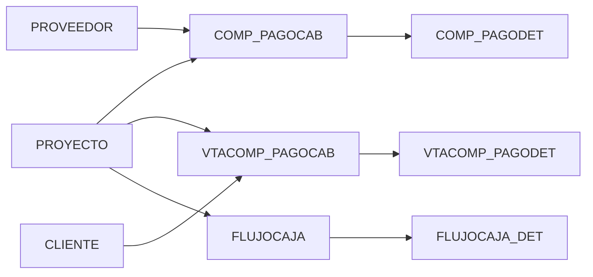

# 🎯 Sistema de Gestión de Comprobantes de Pago

Sistema moderno y completo para gestión de comprobantes de pago (ingresos/egresos) con arquitectura multi-tenant. Desarrollado con las tecnologías más actuales de 2025.

## ✨ Características Principales

- 📊 **Dashboard Interactivo** - Visualización en tiempo real de KPIs y métricas
- 💰 **Gestión de Comprobantes** - Control completo de ingresos y egresos
- 📄 **PDFs Profesionales** - Generación automática de comprobantes en PDF ⭐ **NUEVO**
- 🎨 **Sistema de Estados** - REG/PAG/ANU con badges visuales de colores ⭐ **NUEVO**
- 💳 **Módulo de Abonos** - Registro completo de pagos con vouchers ⭐ **NUEVO**
- 📎 **Gestión de Archivos** - Subida y descarga de FotoCP y FotoAbono ⭐ **NUEVO**
- 📈 **Flujo de Caja** - Análisis y proyecciones financieras
- 🏢 **Multi-tenant** - Soporte para múltiples empresas
- 🎨 **UI Moderna** - Diseño responsive con shadcn/ui
- 🔐 **Seguridad** - JWT Authentication y Spring Security
- 📱 **Responsive** - Funciona en desktop, tablet y móvil

## 🎉 Nuevas Funcionalidades (Nov 2025)

### 📄 Generación de PDFs Profesionales
- **Diseño corporativo** con encabezado CONSANDINA
- **Badge de estado** con colores (REGISTRADO/PAGADO/ANULADO)
- **Tabla de partidas** profesional con bordes
- **Total destacado** en azul
- **Descarga con un clic** desde el botón "Descargar PDF"
- 👉 [**Ver Guía Rápida**](PRUEBA_RAPIDA_PDF.md)

### 🎨 Sistema de Estados
- **REGISTRADO** (REG) - Badge gris - Pago pendiente
- **PAGADO** (PAG) - Badge verde - Pago completado
- **ANULADO** (ANU) - Badge rojo - Comprobante anulado
- Cambio automático al registrar pago

### 💳 Módulo de Abonos (Pagos)
- Registro de fecha de pago (FecAbono)
- 7 medios de pago disponibles
- Descripción del pago (DesAbono)
- Subida de voucher bancario (FotoAbono)

### 📎 Gestión de Archivos
- **FotoCP**: Comprobante original (factura del proveedor)
- **FotoAbono**: Voucher de pago (comprobante bancario)
- Validación: PDF, JPG, PNG (máx 10MB)
- Almacenamiento seguro en servidor

## 📚 Documentación Completa

### 🚀 **Inicio Rápido**
- [**ÍNDICE.md**](INDICE.md) - Navegación completa de la documentación
- [**PRUEBA_RAPIDA_PDF.md**](PRUEBA_RAPIDA_PDF.md) - Prueba el sistema en 3 pasos

### 🎓 **Para el Profesor / Evaluador**
- [**RESUMEN_EJECUTIVO_PROFESOR.md**](RESUMEN_EJECUTIVO_PROFESOR.md) - Resumen completo para evaluación

### 👤 **Guías de Usuario**
- [**COMO_USAR.md**](COMO_USAR.md) - Manual completo del sistema
- [**GUIA_PDF_PROFESIONAL.md**](GUIA_PDF_PROFESIONAL.md) - Todo sobre PDFs
- [**uploads/ejemplos/README-COMO-USAR-ARCHIVOS.md**](uploads/ejemplos/README-COMO-USAR-ARCHIVOS.md) - Guía de archivos

### 🔧 **Guías Técnicas**
- [**RESUMEN_IMPLEMENTACION_PDF.md**](RESUMEN_IMPLEMENTACION_PDF.md) - Documentación técnica de PDFs
- [**RESUMEN_IMPLEMENTACION.md**](RESUMEN_IMPLEMENTACION.md) - Resumen general
- [**GUIA_TESTING.md**](GUIA_TESTING.md) - Guía de pruebas

## 🎯 Demo Rápida

```bash
# 1. Abrir navegador en:
http://localhost:3000/comprobantes/egreso-7005-CP-007

# 2. Hacer clic en:
"Descargar PDF"

# 3. Ver el PDF profesional descargado:
Comprobante-CP-007-2025-11-25.pdf
```

## 🚀 Stack Tecnológico 2025

### Backend
- **Spring Boot**: 3.5.7
- **Java**: 21 (LTS)
- **Base de Datos**: Oracle 23c Free
- **Seguridad**: Spring Security + JWT
- **Documentación**: SpringDoc OpenAPI 3
- **ORM**: Spring Data JPA + Hibernate

### Frontend (Moderno)
- **Next.js**: 16.0.1 (App Router)
- **React**: 19.0.0
- **TypeScript**: 5.7.2
- **TailwindCSS**: 4.1.0
- **shadcn/ui**: Componentes modernos
- **TanStack Query**: v5.62.7 (Data fetching)
- **TanStack Table**: v8.20.6 (Tablas avanzadas)
- **Zustand**: 5.0.2 (State management)
- **Recharts**: 2.14.1 (Gráficos)
- **React Hook Form**: 7.54.2 (Formularios)
- **Zod**: 3.24.1 (Validación)

## 📋 Inicio Rápido

### Opción 1: Script Automático (Recomendado)

**Linux/Mac:**
```bash
chmod +x start.sh
./start.sh
```

**Windows:**
```bash
start.bat
```

### Opción 2: Manual con Docker

**1. Levantar servicios**
```bash
docker-compose -f .devcontainer/docker-compose.yml up -d
```

**2. Ejecutar schema (esperar 60 segundos)**
```bash
docker exec -it oracle-db sqlplus oracle/oracle@FREEPDB1 @/workspace/schema.sql
```

**3. Instalar y ejecutar frontend**
```bash
cd frontend
npm install
npm run dev
```

### Opción 3: Sin Docker

Ver [INSTALACION.md](./INSTALACION.md) para instalación manual completa.

## 🔗 URLs

- **Frontend**: http://localhost:3000
- **Backend API**: http://localhost:8080/api
- **Swagger UI**: http://localhost:8080/api/swagger-ui.html
- **Health Check**: http://localhost:8080/api/actuator/health

## 📚 Documentación

- [STACK.md](./STACK.md) - Stack tecnológico completo
- [INSTALLATION.md](./INSTALLATION.md) - Guía de instalación detallada
- [backend/README.md](./backend/README.md) - Documentación del backend
- [frontend/README.md](./frontend/README.md) - Documentación del frontend

## 🗄️ Base de Datos

El sistema utiliza Oracle Database con las siguientes tablas principales:

- **CIA** - Compañías (multi-tenant)
- **PERSONA** - Personas base
- **CLIENTE, PROVEEDOR, EMPLEADO** - Tipos de personas
- **PROYECTO** - Proyectos
- **COMP_PAGOCAB, COMP_PAGODET** - Comprobantes de pago
- **VTACOMP_PAGOCAB, VTACOMP_PAGODET** - Comprobantes de venta
- **FLUJOCAJA, FLUJOCAJA_DET** - Flujo de caja
- **PARTIDA, PARTIDA_MEZCLA** - Partidas presupuestarias

## 🔧 Configuración

### Variables de Entorno

Copiar `.env.example` y ajustar según necesidad:

```bash
cp .env.example .env
```

### Conexión a Base de Datos

El backend está configurado para conectarse automáticamente al contenedor Oracle:

- **Host**: `oracle` (nombre del servicio Docker)
- **Puerto**: 1521
- **Database**: FREEPDB1
- **Usuario**: oracle
- **Password**: oracle

## 🛠️ Desarrollo

### Backend

```bash
cd backend
./mvnw spring-boot:run
```

### Frontend

```bash
cd frontend
npm run dev
```

## 📦 Estructura del Proyecto

```
payment-vouchers-management/
├── .devcontainer/          # Configuración Docker
├── backend/                # Spring Boot API
│   └── src/main/
│       ├── java/
│       └── resources/
├── frontend/               # Next.js App
│   └── src/
│       ├── app/
│       ├── components/
│       └── lib/
├── schema.sql             # Schema de base de datos
├── STACK.md              # Documentación del stack
└── README.md             # Este archivo
```

## 🤝 Contribuir

1. Fork el proyecto
2. Crear una rama (`git checkout -b feature/AmazingFeature`)
3. Commit los cambios (`git commit -m 'Add some AmazingFeature'`)
4. Push a la rama (`git push origin feature/AmazingFeature`)
5. Abrir un Pull Request

## 📄 Licencia

Este proyecto está bajo la Licencia Apache 2.0 - Proyecto 9

## 🎯 Descripción

Sistema integral para la **gestión de comprobantes de pago de ingresos y egresos** vinculados a proyectos, proveedores, clientes y especialistas. Controla el flujo financiero completo desde la emisión del comprobante hasta el pago efectivo, con seguimiento de montos acumulados y saldos pendientes.

## 🏗️ Arquitectura del Sistema

### Stack Tecnológico
- **Base de Datos:** Oracle Database 23c
- **Backend:** Spring Boot 3.5.6 + JPA/Hibernate
- **Java:** 21
- **Build Tool:** Maven
- **Arquitectura:** Layered (Entity → Repository → Service → Controller)

### Librerías Principales
- Spring Data JPA
- Lombok (Reducción de boilerplate)
- MapStruct (Mapeo DTO/Entity)
- SpringDoc OpenAPI (Documentación Swagger)
- Oracle JDBC Driver (ojdbc11)

## 📦 Módulos del Sistema

### 1. **Gestión de Egresos** (Pagos)
- Comprobantes de pago a proveedores y especialistas
- Control de montos acumulados vs contratados
- Estados: Registrado, Pagado, Pendiente, Vencido
- Tipos: Facturas, Recibos por Honorarios, Boletas

### 2. **Gestión de Ingresos** (Cobros)
- Facturas emitidas a clientes
- Control de cuentas por cobrar
- Seguimiento de pagos recibidos

### 3. **Flujo de Caja**
- Proyección mensual (12 meses)
- Comparación: Proyectado vs Real
- Consolidado por proyecto

## 📋 Modelo de Datos

### Tablas Core (6 principales)
```
COMP_PAGOCAB          → Comprobantes de pago (Egresos - Cabecera)
COMP_PAGODET          → Detalle de egresos por partida
VTACOMP_PAGOCAB       → Facturas de venta (Ingresos - Cabecera)
VTACOMP_PAGODET       → Detalle de ingresos por partida
FLUJOCAJA             → Maestro de flujo de caja
FLUJOCAJA_DET         → Detalle mensual (Ene-Dic)
```

### Tablas Maestras Compartidas (8)
```
CIA                   → Compañías
PERSONA               → Personas (naturales/jurídicas/empleados)
PROVEEDOR             → Proveedores
CLIENTE               → Clientes
EMPLEADO              → Empleados/Especialistas
EMPRESA_VTA           → Empresas contratistas
TABS                  → Catálogo de tablas
ELEMENTOS             → Elementos de catálogos
```

### Módulo Presupuesto (12 tablas)
```
PARTIDA               → Partidas presupuestales maestras
PARTIDA_MEZCLA        → Composición de partidas
PROY_PARTIDA          → Partidas por proyecto
PROY_PARTIDA_MEZCLA   → Desglose por proyecto
DPROY_PARTIDA_MEZCLA  → Desembolsos programados
+ Tablas de respaldo (P*)
```

## 🔗 Relaciones Principales



## 🚀 Inicio Rápido

### 1. Configurar Base de Datos
```sql
-- Conectar a Oracle Database
sqlplus usuario/contraseña@localhost:1521/XE

-- Ejecutar script de creación
@schema.sql
```

### 2. Configurar Backend
```bash
# Editar application.properties
spring.datasource.url=jdbc:oracle:thin:@localhost:1521:XE
spring.datasource.username=tu_usuario
spring.datasource.password=tu_password

# Compilar y ejecutar
cd backend
./mvnw clean install
./mvnw spring-boot:run
```

### 3. Acceder a Swagger UI
```
http://localhost:8080/api/swagger-ui.html
```

## 📊 Catálogos del Sistema

### Estados (EST)
- **REG** - Registrado
- **PAG** - Pagado
- **PEN** - Pendiente
- **VEN** - Vencido

### Tipos de Comprobante (TCP)
- **FAC** - Factura
- **REC** - Recibo por Honorarios
- **BOL** - Boleta de Venta

### Monedas (MON)
- **PEN** - Soles (S/)
- **USD** - Dólares (US$)
- **EUR** - Euros (€)

### Unidades de Medida (UNI)
- **UND** - Unidad
- **M2** - Metro Cuadrado
- **KG** - Kilogramo
- **GLN** - Galón

## 🔐 Validaciones de Negocio

### Comprobantes de Pago
- Total cabecera debe coincidir con suma de detalles
- Fecha de abono >= Fecha de emisión
- Estado válido: REG, PAG, PEN, VEN

### Flujo de Caja
- Tipo: P (Proyectado) o R (Real)
- Movimiento: I (Ingreso) o E (Egreso)
- Detalle mensual obligatorio por año

### Control de Acumulados
- Monto acumulado ≤ Monto contratado (especialistas)
- Validación por proyecto y especialista

## 📁 Estructura del Proyecto

```
payment-vouchers-management/
├── backend/
│   ├── src/main/java/com/proyectos/comprobantespago/
│   │   ├── entity/           # Entidades JPA
│   │   ├── repository/       # Repositorios Spring Data
│   │   ├── service/          # Lógica de negocio
│   │   ├── controller/       # API REST
│   │   ├── dto/              # Data Transfer Objects
│   │   └── config/           # Configuración
│   └── pom.xml
├── schema.sql                # Script completo BD (26 tablas)
├── db-schema.sql             # Script simplificado (15 tablas)
├── diagrama-er.md            # Diagrama completo 26 tablas
├── diagrama-proyecto9.md     # Diagrama proyecto 9
└── README.md                 # Este archivo
```

## 🎓 Casos de Uso Principales

### 1. Registrar Egreso
```
Usuario → Selecciona Proyecto
       → Selecciona Proveedor
       → Ingresa comprobante (Nro, Fecha, Monto)
       → Detalla partidas
Sistema → Valida montos
        → Registra comprobante (Estado: REG)
        → Actualiza flujo de caja
```

### 2. Pagar Comprobante
```
Usuario → Selecciona comprobante pendiente
       → Ingresa fecha y forma de pago
       → Adjunta constancia
Sistema → Cambia estado a PAG
        → Actualiza flujo de caja real
        → Calcula acumulados
```

### 3. Consultar Flujo de Caja
```
Usuario → Selecciona Proyecto + Año
Sistema → Muestra comparativo mensual:
          - Proyectado vs Real
          - Ingresos vs Egresos
          - Saldos por mes
```

## 👥 Roles del Sistema

- **Administrador:** Gestión completa del sistema
- **Contador:** Registro y control de comprobantes
- **Jefe de Proyecto:** Consulta de flujo de caja
- **Tesorero:** Registro de pagos efectivos

## 📞 Soporte

**Proyecto Académico - Universidad**
Módulo: Proyecto 9 - Gestión de Comprobantes de Pago
Grupo: [Tu Grupo]
Ciclo: [Tu Ciclo]

---

## 📝 Notas Importantes

⚠️ **Integración con Otros Proyectos:**
- Proyecto 1 (Grupo 1): Tabla única PROYECTO
- Proyecto 5: Gestión de Personal y Proveedores

⚠️ **Tablas de Respaldo:**
- PPROYECTO, PPARTIDA, etc. mantienen historial
- Prefijo "P" indica tabla de respaldo

⚠️ **Flujo de Caja:**
- 26 columnas por año (12 meses × 2: Proyectado + Real)
- Actualización automática al registrar comprobantes

---

**Versión:** 1.0
**Última Actualización:** Noviembre 2025
**Base de Datos:** Oracle 23c
**Framework:** Spring Boot 3.5.6
